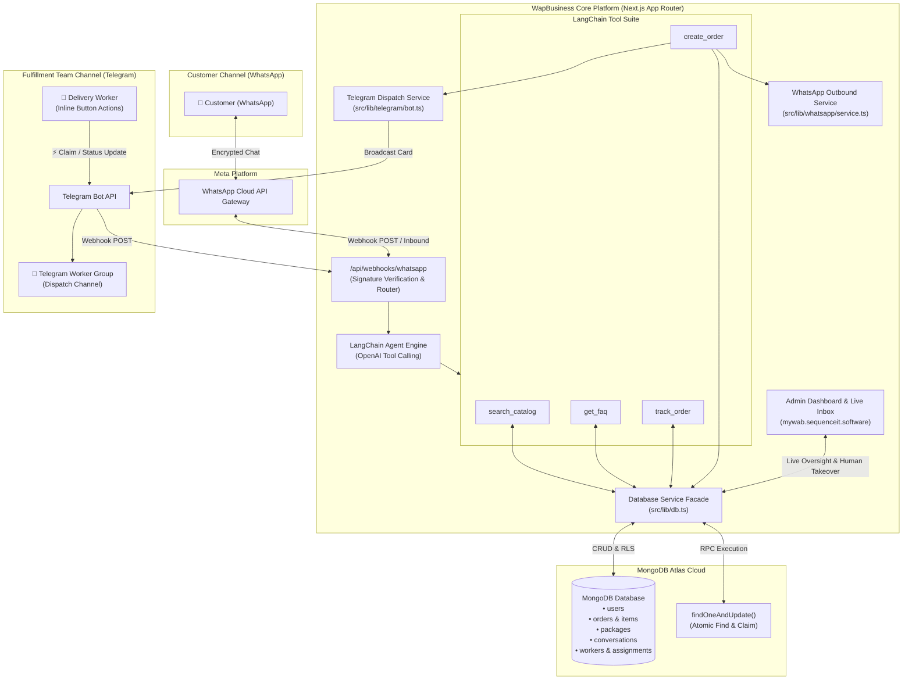
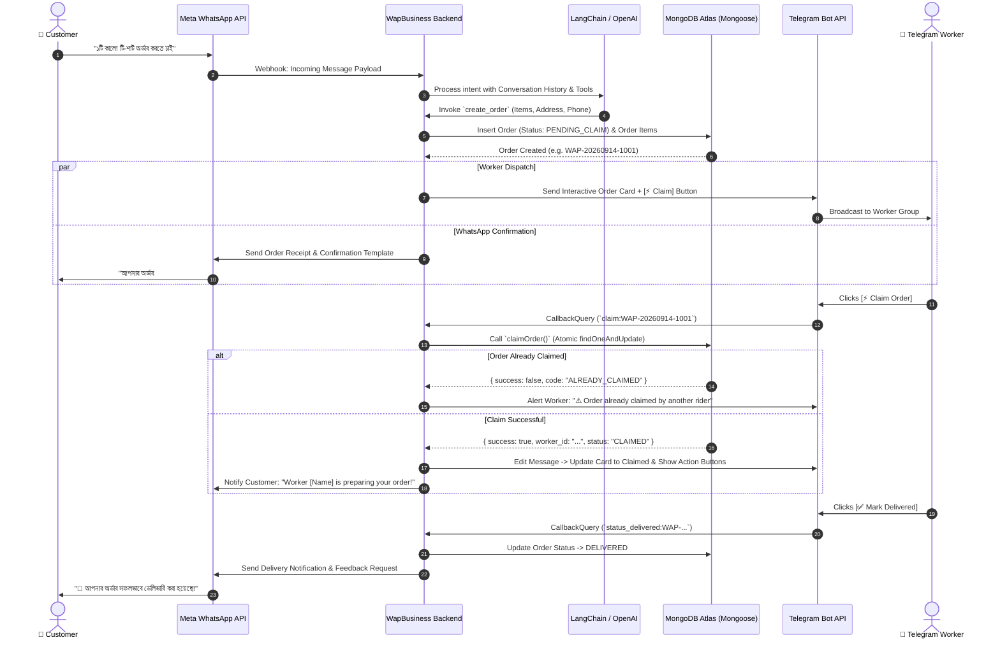
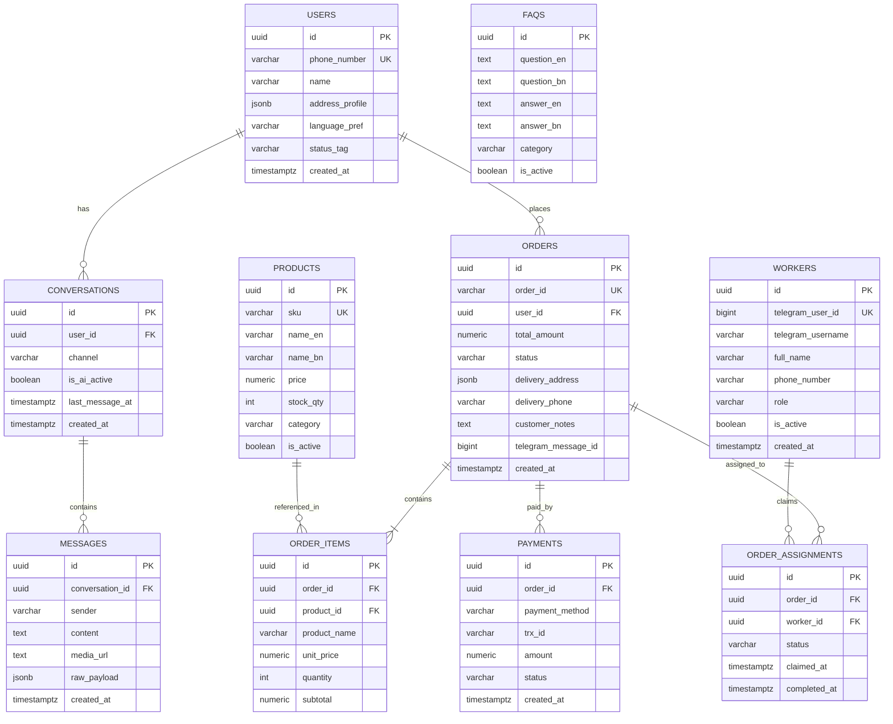

# WapBusiness (MyWab)
### WhatsApp AI Commerce & Telegram Worker Fulfillment Dispatch Engine

[](https://nextjs.org/)
[](https://www.mongodb.com/)
[](https://www.langchain.com/)
[](https://developers.facebook.com/)
[](https://core.telegram.org/bots)
[](https://www.docker.com/)
[](https://traefik.io/)

---

## 📌 Executive Summary

**WapBusiness** is an enterprise conversational commerce platform engineered to automate end-to-end e-commerce operations. It unifies:
1. **Bilingual Customer Shopping via WhatsApp**: Conversational product discovery, automated FAQ resolution, and dynamic order placement in Bengali & English powered by **LangChain + OpenAI**.
2. **Real-time Worker Dispatch via Telegram**: Instant dispatch of confirmed orders into a Telegram fulfillment group with **atomic order locking** (preventing race conditions / double-claims).
3. **Centralized Operations Hub**: A secure Next.js dashboard featuring live order tracking, chat monitoring with one-click human takeover, product catalog management, and staff analytics backed by **MongoDB Atlas & Mongoose**.

---

## 🏗️ Architecture Diagrams

### 1. High-Level System Architecture



---

### 2. Order Lifecycle & Dispatch Sequence



---

### 3. Database Entity Relationship Model



---

## 🛠️ Technology Stack

| Layer | Technology | Description |
|---|---|---|
| **Framework** | Next.js 15.2 (App Router) | Server Actions, API Route Handlers, Standalone output |
| **Language & Typing** | TypeScript 5.8 & React 19 | Strictly typed components, interfaces, and schemas |
| **Styling & UI** | Tailwind CSS + Lucide Icons | Responsive dark theme with curated glassmorphism |
| **Database & Auth** | MongoDB Atlas (Mongoose 9) | Document collections, schema validation, atomic operations |
| **AI / Agent Core** | LangChain + OpenAI | Tool-calling agent (`gpt-4o-mini`, `gpt-5-mini`, etc.) |
| **Customer Messaging** | Meta WhatsApp Cloud API (v21.0) | Webhook intake, interactive messages, templates |
| **Worker Dispatch** | Telegram Bot API (GrammY) | Group broadcasts, inline keyboards, callback updates |
| **Containerization** | Docker & Docker Compose | Multi-stage Alpine containerization |
| **Reverse Proxy** | Traefik | Automated TLS certificates & subdomain routing |

---

## 🚀 Getting Started (Local Development)

### 1. Prerequisites
- Node.js 20.x or higher
- npm 10.x or higher
- MongoDB Atlas Cluster or local MongoDB instance

### 2. Installation
```bash
# Clone the repository
git clone https://github.com/sequenceit-git/mywab.git
cd mywab

# Install project dependencies
npm install
```

### 3. Environment Setup
Copy the template and configure your credentials:
```bash
cp .env.example .env
```

Edit `.env`:
```env
# MongoDB Atlas Configuration
MONGODB_URI=mongodb+srv://<username>:<password>@<cluster>.mongodb.net/<database>?retryWrites=true&w=majority

# OpenAI Configuration
OPENAI_API_KEY=sk-proj-...
OPENAI_MODEL=gpt-4o-mini

# WhatsApp Cloud API
WHATSAPP_PHONE_NUMBER_ID=1234567890
WHATSAPP_ACCESS_TOKEN=EAAT...
WHATSAPP_VERIFY_TOKEN=wapbusiness_secure_verify_token

# Telegram Bot
TELEGRAM_BOT_TOKEN=123456789:ABC...
TELEGRAM_WORKER_GROUP_ID=-1001234567890

# Subdomain & Admin Auth
NEXT_PUBLIC_APP_URL=https://mywab.sequenceit.software
DOMAIN=mywab.sequenceit.software
ADMIN_EMAIL=admin@sequenceit.software
ADMIN_PASSWORD=admin123456
AUTH_SECRET=your_super_secret_session_key
```

### 4. Database Setup
The models are defined in `src/lib/db/models/`. Mongoose automatically initializes and indexes the collections upon first connection.

### 5. Launch Development Server
```bash
npm run dev
```
Open [http://localhost:3000](http://localhost:3000) in your browser.

---

## 🐳 Docker & Traefik Production Deployment

This project is configured with a multi-stage Docker build and native Traefik reverse proxy labels.

### 1. Subdomain & Network Matching
Ensure your `.env` contains your domain and Traefik Docker network:
```env
DOMAIN=mywab.sequenceit.software
TRAEFIK_NETWORK=traefik-network   # Name of your active Traefik external network
CERT_RESOLVER=letsencrypt
```

### 2. Build and Run Container
```bash
# Build and launch with Docker Compose
docker compose up -d --build

# View real-time container logs
docker compose logs -f app
```

---

## 🔐 Admin Authentication Panel

The dashboard is protected by session middleware (`src/middleware.ts`).

| Field | Default Value |
|---|---|
| **Login URL** | `https://mywab.sequenceit.software/login` |
| **Default Email** | `admin@sequenceit.software` |
| **Default Password** | `admin123456` |

*You can customize admin credentials anytime in `.env` using `ADMIN_EMAIL` and `ADMIN_PASSWORD`.*

---

## 🔗 Webhook Endpoints

| Service | Path | Description |
|---|---|---|
| **WhatsApp Inbound** | `GET /api/webhooks/whatsapp` | Webhook verification handshake with Meta |
| **WhatsApp Message Event** | `POST /api/webhooks/whatsapp` | Receives incoming customer messages & triggers LangChain agent |
| **Telegram Callback** | `POST /api/webhooks/telegram` | Receives worker claim & status updates from Telegram buttons |

---

## 📄 License

This software is developed and maintained by **SequenceIT**. All rights reserved.
